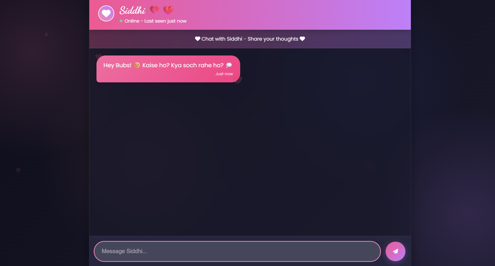

# WTF-Were-We-Thinking
A chatbot trained on your past relationship texts, serving up nostalgic, cringe, and downright baffling conversations from your digital archives. Whether you're laughing, sighing, or questioning all your life choices, this AI-powered time machine lets you relive the "What was I even thinking?" moments with your ex—no emotional baggage required

Features
💬 Hinglish conversations (Hindi + English mix) with emojis

🎭 Personality mimicking Siddhi's sarcastic, caring and possessive traits

⏳ Message history recall for contextual responses

✨ Beautiful gradient UI with floating hearts

📱 Responsive design works on mobile & desktop

⌨️ Real-time typing indicators

Setup
Clone this repository

Install dependencies:

bash - npm install
Run the web interface:

bash - open index.html
Or run the CLI version:

bash-node Ex.js
Configuration
Edit the systemInstructionText in index.html to customize:

Names/nicknames used (Bubs, Siddhi, etc.)

Personality traits

Conversation style

Inside jokes/references

Tech Stack
Frontend: HTML/CSS/JavaScript

Backend: Google Gemini API

Styling: Font Awesome icons, Google Fonts

CLI: Node.js with readline-sync

Warning
This project is for nostalgic/entertainment purposes only. Be mindful of your emotional wellbeing when interacting with AI simulations of past relationships.
